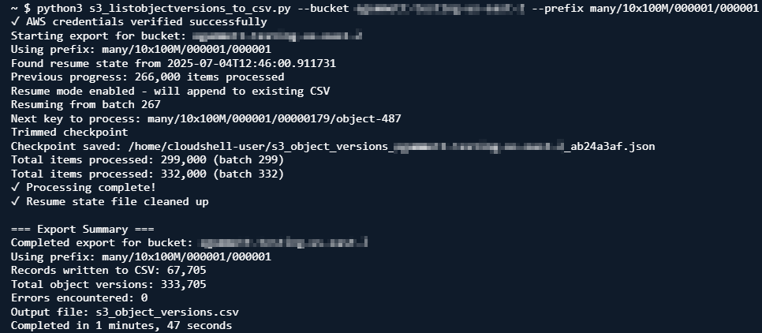

# Listing S3 Object Versions to CSV

A robust Python script for exporting a list of S3 object versions, in CSV format, at scale.


## Features

* **All Versions**: Export every version of every object key, not just the current version, including [delete markers](https://docs.aws.amazon.com/AmazonS3/latest/userguide/DeleteMarker.html)
    * If [S3 Versioning](https://docs.aws.amazon.com/AmazonS3/latest/userguide/Versioning.html) is disabled, there will only be one version of each key, with a ‘null’ version ID, and no delete markers
* **Prefix support**: Export only a specific [prefix](https://docs.aws.amazon.com/AmazonS3/latest/userguide/using-prefixes.html), without scanning the entire bucket
* **Authentication token refresh:** Automatically recover on session token expiry
* **Resume capability:** Automatically resumes from checkpoint (in case of disconnects or other errors)
* **Output format control:** Choose to remove CSV column headings, or restrict columns to those expected by S3 Batch Operations.
* **Offline filtering**: Create multiple manifests from one export, without repeated API calls
* **Memory-efficient:** Streaming output to CSV
* **Flexible authentication:** Supports all AWS credential methods

## Performance

* 3 million object versions → 432 MB CSV in 15 minutes (on a [t2.micro instance](https://aws.amazon.com/ec2/instance-types/t2/))
* 60 million object versions → 8 GB CSV in 5.5 hours

**Note**: S3 [ListObjectVersions](https://docs.aws.amazon.com/AmazonS3/latest/API/API_ListObjectVersions.html)operations must be sequential in order to ensure all objects are included, and this restricts performance. If desired, you could run multiple instances of this script in parallel against different prefixes (creating separate CSVs for each).


## Usage

### Standard output

`python3 s3_listobjectversions_to_csv.py --bucket my-bucket `

Outputs a file in the local directory named `s3_object_versions.csv`. Specify output file with `--output /path/logs.csv`

### Specific prefix Only

`python s3_listobjectversions_to_csv.py --bucket my-bucket --prefix logs/2024/ `

### Skip bucket versioning check

By default the tool will check whether S3 Versioning is enabled. This requires permission to use the `s3:GetBucketVersioning` API on the bucket. To skip this check, use `--skipversioningcheck`

### Specify an AWS profile

The tool uses AWS CLI credentials. If you want to specify a particular profile, add `--profile my-profile` 

### Disable resume

By default, re-running the previous command will cause the tool to resume from the last checkpoint, appending the output file. To disable the checkpointing and resume functionality (overwriting any existing CSV), add `--noresume`

### For all options and more detail

`python s3_listobjectversions_to_csv.py -help`


## Output Formats

### **Standard** (default)

```
bucket_name,key_name,version_id,is_latest,delete_marker,size,last_modified,storage_class
```

### **No CSV Headers** (`--nocsvheaders`)

Doesn’t include a header row in the CSV.

### **Batch Operations Manifest Compatible** (`--bopsmanifestcompatible`) 

Leaves only the columns that S3 Batch Operations expects. Automatically includes `--nocsvheaders`

```
bucket_name,key_name,version_id
```

### **No URL-encoding** (`--urlencoding`)

Prevents URL-encoding of object key names, for example replacing <space> with `+` . Note that if you have commas in your object names, this will interfere with subsequent processing of the CSV output. URL-encoding is always enabled when `--bopsmanifestcompatible`  is enabled, as S3 Batch Operations requires URL-encoded keys.


## Example use cases for filtering

### Create a manifest of noncurrent versions to delete

```
awk -F',' '$4=="False" && $5=="False"' s3_object_versions.csv | cut -d',' -f1-3 > old_versions.csv
```

### Create a manifest of delete markers to delete

```
`awk -F',' '$5=="True"' s3_object_versions.csv | cut -d',' -f1-3 > delete_markers.csv`
```

### Create a manifest of older objects to archive

```
awk -F',' 'substr($7,1,4) < "2023"' s3_object_versions.csv | cut -d',' -f1-3 > archive.csv
```

### Current versions that are in the STANDARD storage class

```
awk -F',' '$4=="True" && $8=="STANDARD"' s3_object_versions.csv | cut -d',' -f1-3 > standard_current.csv
```


## Explanation of resume functionality

### **Checkpoint creation**

* Saves progress every 20 batches (20,000 items)
* Saves on Ctrl+C cancellation
* Saves on errors before exit
* Checkpoint filename includes checksum of job parameters: `outputfile_bucket_checksum.json`

### **What's saved**

* Current batch number and position markers
* Total items processed so far
* List of processed object keys+versions (for deduplication)
* Timestamp and job parameters

### **Resume process**

* The resume is automatic - just run the same command again and the tool will pick up where it left off.
* Looks for existing checkpoint file with matching checksum
* Rejects checkpoints older than 24 hours
* Validates CSV has not been updated externally
* Prompts to overwrite CSV if resume fails (mismatched parameters, old checkpoint, etc.)
* Loads processed keys to avoid duplicates
* Continues from last saved position using S3 pagination markers
* Tracks unique `key_name-version_id` combinations
* Skips already processed items when resuming
* Appends new data to existing CSV file
* Removes checkpoint file on successful completion


## Cost

The script lists the default and maximum of 1000 objects per request. Listing 100 million object versions in the Standard or Intelligent-Tiering [storage classes](https://aws.amazon.com/s3/storage-classes/) (using 100,000 requests) costs $0.50 at time of writing. For details, see https://aws.amazon.com/s3/pricing .


## Requirements

* Python 3.6+
* [Boto3](https://boto3.amazonaws.com/)- install with `pip install boto3`
* Minimum permission: `s3:ListBucketVersions`
    * `s3:GetBucketVersioning` is also required, unless using the option `--skipversioningcheck`
* An S3 general purpose bucket. The script does not work with S3 [directory buckets](https://docs.aws.amazon.com/AmazonS3/latest/userguide/directory-buckets-overview.html) used with the [S3 Express One Zone storage class](https://aws.amazon.com/s3/storage-classes/express-one-zone/), or S3 Tables buckets.


## Security note

Some scanners may incorrectly flag this script with [CWE-78](https://cwe.mitre.org/data/definitions/78.html) due to its use of a subprocess call when refreshing credentials. `Shell=False` is set explicitly to mitigate this, as well as input and profile name validation.
